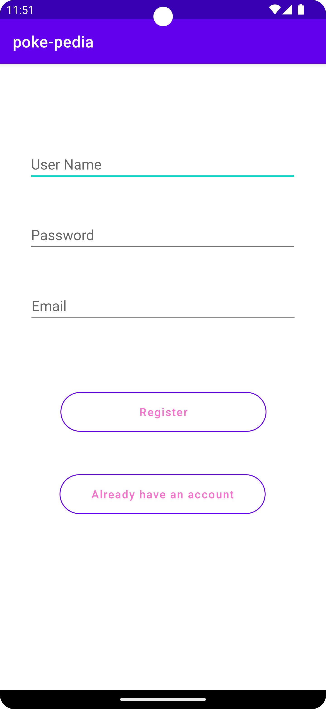
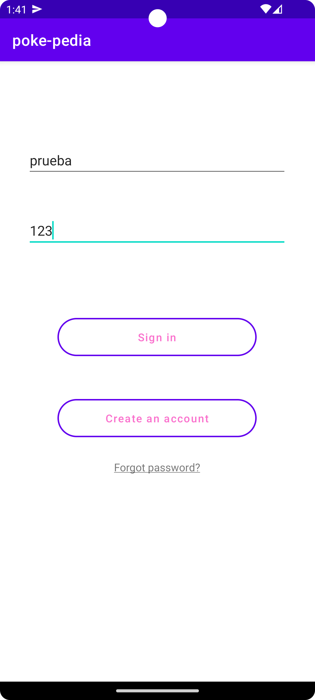
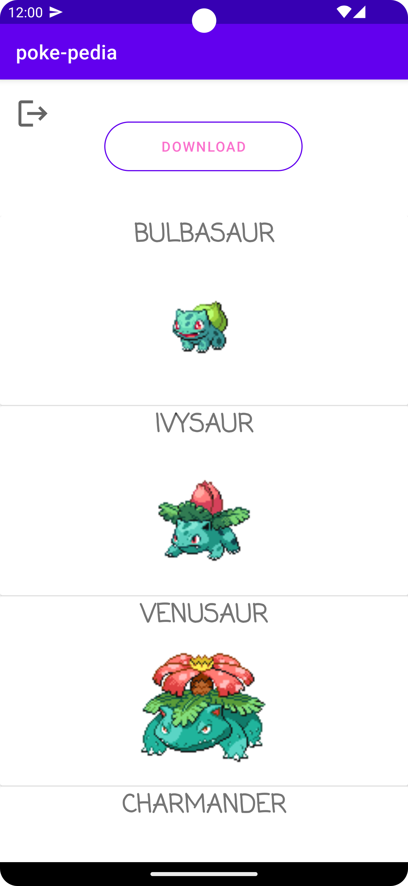
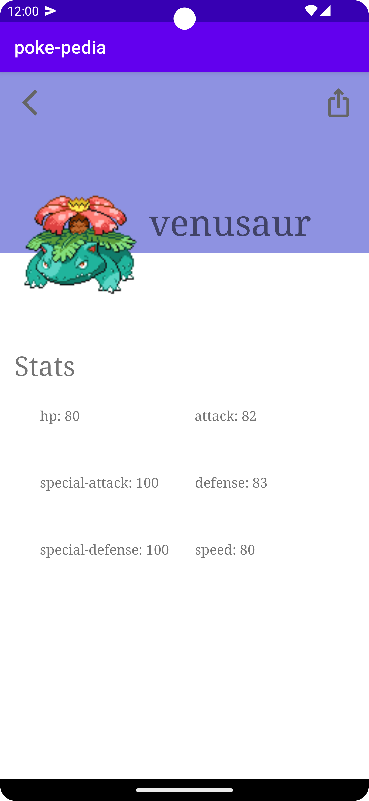

<h1>PokePedia</h1>

Aplicacion en desarrollo, la cual busca el visualizado de las estadísticas de los pokemon obtenidos directamente desde la PokeAPI.

<h3>Pantalla de registro</h3>
Permite el registro de usuarios gracias a la base de datos en SQLite, donde se almacenara su nombre de usuario, contrasegna y correo.

<h3>Pantalla de login</h3>
Accedemos a la aplicacion mediante nuestro usuario y constrasegna, permitiendonos ademas modificar nuestra contrasegna en caso de no recordarla.

<h3>Pantalla principal</h3>
Con el boton download descarga los pokemon desde la API PokeAPI, los cuales se almacenaran en nuestra base de datos, junto con su imagen y sus estadisiticas.

<h3>Estadisticas Pokemon</h3>
Muestra las estadisticas de cada pokemon, permitiendonos compartirlas ademas de la imagen del pokemon.

<h2>Futuras actualizaciones</h2>
    <li>
        Rediseño del grid en la pantalla principal para una mejor visualizacion de los pokemon
    </li>
    <li>
        Adicion de los movimientos de cada pokemon a la pantalla de estadisticas
    </li>